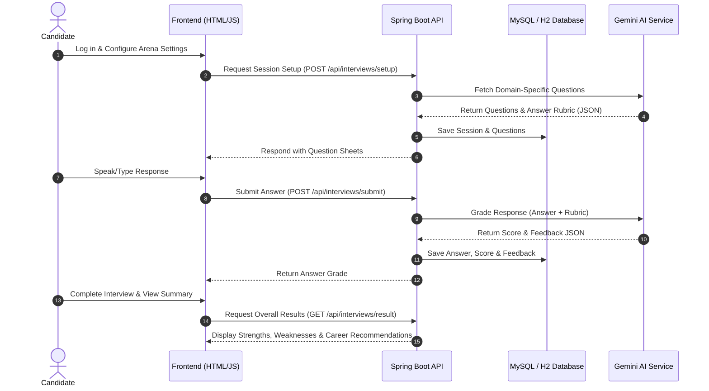

# 🤖 InterviewAI — Advanced AI Mock Interview Platform

[](https://openjdk.org/)
[](https://spring.io/projects/spring-boot)
[](https://deepmind.google/technologies/gemini/)
[](https://www.mysql.com/)
[](https://opensource.org/licenses/MIT)

**InterviewAI** is an advanced web-based simulator designed to supercharge engineering and human resources placement preparations. It uses state-of-the-art Generative AI (Google Gemini & OpenAI) alongside native browser APIs to recreate real-world technical screens, speech-to-text behavioral interviews, and interactive coding arenas, providing instant granular grading and actionable feedback.

---

## 📖 Project Overview

Preparing for high-stakes technical interviews often lacks realistic simulation and real-time guidance. **InterviewAI** fills this gap by acting as an automated technical screener and career coach. The system:
- Dynamically generates domain-specific question sheets tailored to user experience levels.
- Transcribes and grades speech responses for voice-based phone screens.
- Offers an interactive Web-IDE environment with test case evaluation.
- Scans resumes using an ATS keyword engine to map compatibility against requirements.

---

## ✨ Features

- **🗣️ Audio/Speech-to-Text Screener**: Practice phone or virtual screens using the browser's native speech recognition wrapper to capture verbal explanations and evaluate vocabulary.
- **💻 Interactive IDE Coding Arena**: Solve classic programming challenges (Java, Python, C++, SQL, JS) with syntax highlights, preloaded starter templates, and client-side test case verification.
- **📄 Smart ATS Resume Parser**: PDF upload parses resume text via Apache PDFBox. Generative AI scans it against job description keywords and estimates an ATS compatibility score with suggested improvements.
- **📈 Comprehensive Dashboard & Progress Tracking**: Review performance metrics, past interview scores, average ranking statistics, category coverage maps, and bookmarked questions.
- **⚙️ Dynamic Admin Configuration Panel**: Swap AI models, tweak temperature parameters, update default system prompt instructions, or toggle between Mock, Google Gemini, and OpenAI APIs on the fly.

---

## 🛠️ Tech Stack

### Backend
- **Core Framework**: Spring Boot 3.3.4 (Java 21)
- **Security**: Spring Security + Stateless JWT (JJWT 0.12.5) for secure role-based session tokens
- **Persistence**: Spring Data JPA + Hibernate DDL Auto-Generation
- **Databases**: MySQL (Production-ready) and H2 Database (In-Memory for rapid local dev)
- **Document Processing**: Apache PDFBox 3.0.3 (Text extraction from PDF resumes)
- **AI Integrations**: REST Client wrapping Gemini v1beta & OpenAI Chat Completion endpoints
- **Utility Tools**: Lombok for clean boilerplate-free Java code

### Frontend
- **Interface Structure**: Semantic HTML5 & Modern Responsive Layouts
- **Styling**: Vanilla CSS3 (Custom Glassmorphism styling tokens, dark/light theme variables, and dynamic micro-animations)
- **Control & State**: Modern asynchronous Vanilla JavaScript (ES6 Modules, LocalStorage session handling, Web Speech API integration)

---

## 🏗️ Architecture Diagram

Below is the workflow diagram representing client-server interaction and AI validation pipelines:



---

## 📂 Project Structure

```
InterviewAI/
├── .gitignore                   # Version control ignore lists (Maven, IDE, H2 logs)
├── database/                    # Database definitions
│   ├── schema.sql               # Production MySQL DDL tables
│   └── data.sql                 # Starter seeds (pre-defined templates & default settings)
├── backend/                     # Spring Boot Maven application
│   ├── pom.xml                  # Build configs & third-party dependencies
│   └── src/
│       └── main/
│           ├── java/com/interviewai/
│           │   ├── InterviewAiApplication.java
│           │   ├── config/      # Spring Security & CORS setups
│           │   ├── controller/  # REST APIs (Auth, Resume, Interview, Admin, User)
│           │   ├── dto/         # Request & Response Payload objects
│           │   ├── entity/      # Database mapping schema classes
│           │   ├── repository/  # Database access interfaces
│           │   ├── security/    # JWT filters & custom providers
│           │   └── service/     # Gemini, OpenAI, Mock, and Resume parsing logic
│           └── resources/
│               ├── application.properties     # Global configuration settings
│               └── application-dev.properties # Local dev overrides (H2 Configs)
└── frontend/                    # Web interface files
    ├── index.html               # Main landing & demo showcase page
    ├── login.html               # Secure login interface
    ├── dashboard.html           # Student tracking console
    ├── interview.html           # Text interview cockpit
    ├── voice-interview.html     # Voice simulator wrapper
    ├── ide.html                 # Programming practice sandbox
    ├── css/                     # Glassmorphic component styles
    └── js/                      # Asynchronous API integration scripts
```

---

## 🚀 Installation & Setup

### Prerequisites
- [Java Development Kit (JDK) 21+](https://openjdk.org/projects/jdk/21/)
- [Apache Maven 3.9+](https://maven.apache.org/)
- [MySQL Database](https://dev.mysql.com/downloads/installer/) (Optional, defaults to H2 in-memory)

---

### Step 1: Configure Environment Variables
Create a `.env` file or export the following variables on your machine:
```env
# Database Settings (Only if using MySQL in production)
SPRING_DATASOURCE_URL=jdbc:mysql://localhost:3306/interviewai_db
SPRING_DATASOURCE_USERNAME=root
SPRING_DATASOURCE_PASSWORD=yourpassword

# AI API Configurations
GEMINI_API_KEY=your_google_gemini_api_key
OPENAI_API_KEY=your_openai_api_key
```
*Note: If no API key is specified, the application defaults to the mock engine allowing zero-configuration local testing.*

---

### Step 2: Spin Up the Spring Boot Backend
1. Navigate to the backend directory:
   ```bash
   cd backend
   ```
2. Build the project using Maven:
   ```bash
   mvn clean install
   ```
3. Run the Spring Boot application:
   ```bash
   mvn spring-boot:run
   ```
   *The server starts listening on `http://localhost:8080` by default. You can access the H2 console at `http://localhost:8080/h2-console` using JDBC URL `jdbc:h2:mem:interviewaidb` and username `sa`.*

---

### Step 3: Run the Frontend Interface
Since the frontend is built using standard HTML5, CSS3, and JavaScript, it can be launched directly without a compile phase:
- Double-click `frontend/index.html` to open it in your browser.
- Alternatively, run a simple local web server:
  ```bash
  # Python 3
  cd frontend && python -m http.server 3000
  ```
  Then navigate to `http://localhost:3000`.

---

## 🔐 Authentication & Security

- Stateless JWT tokens secure all paths matching `/api/interviews/**`, `/api/resumes/**`, `/api/admin/**`, and `/api/users/**`.
- Standard encryption (`BCryptPasswordEncoder`) secures credentials inside the database.
- CORS rules are pre-configured to allow frontend scripts to safely communicate with port `8080` without resource-sharing blocks.

---

## 🤖 AI Core Integrations

1. **Question Sheet Generation**: The app formats strict prompts instructions forcing the LLM to reply in valid stringified JSON arrays.
2. **Granular Answer Grading**: A response validation framework checks grammar, concept correctness, and provides a numerical rating out of 100 with actionable feedback.
3. **ATS Document Extraction**: Converts raw bytes from PDF uploads into standardized text blocks, indexing matches against industry standard technology taxonomies.

---

## 📸 Screenshots & Mockups

### Student Dashboard
- Visual score cards, total completion progress bars, recent evaluation histories.

### Coding Arena
- In-browser code editing, dynamic syntax templates, run results tabulator console.

---

## 👨💻 Author
- **Your Name** / [GitHub Profile](https://github.com/)

## 🌐 Live Demo
- [Launch Platform Demo](https://localhost:3000) (Replace with your actual hosted cloud address)
